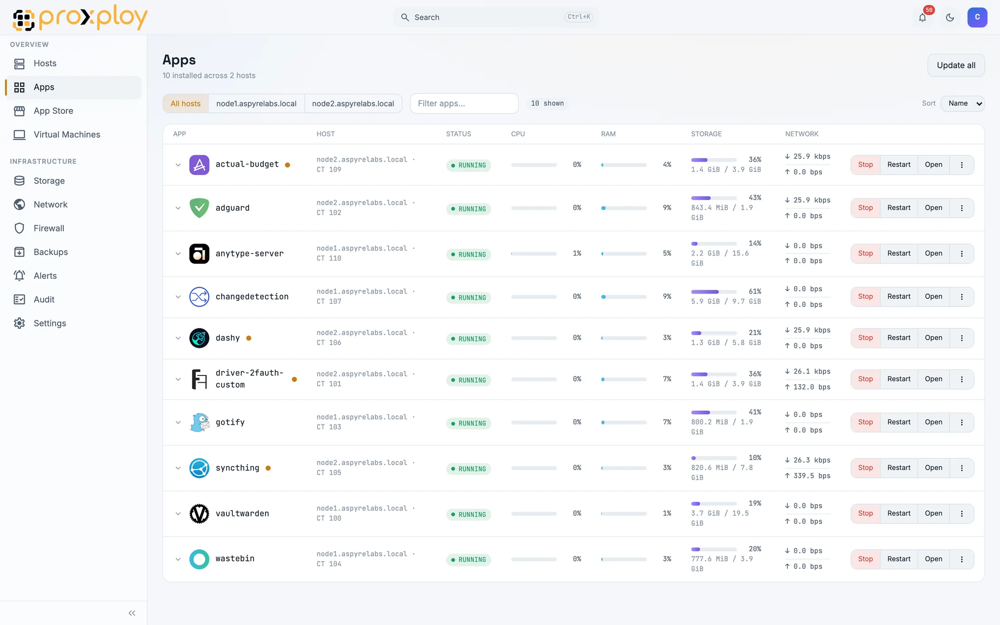
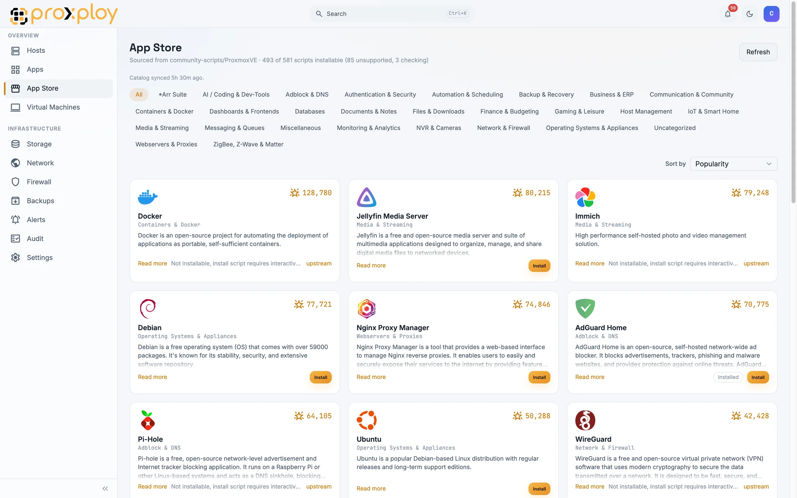
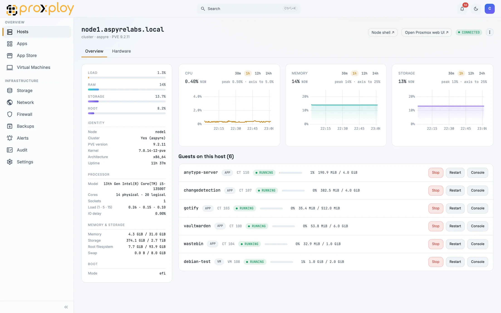

<div align="center">

<picture>
  <source media="(prefers-color-scheme: dark)" srcset="frontend/public/proxploy-logo-light.svg">
  
</picture>

### Your Proxmox cluster, with the console it deserves

Install apps, run VMs and containers, take backups, and hand out access,
from one screen that anyone on your team can use.

[](https://github.com/aspyrelabs/proxploy-app/actions/workflows/ci.yml)
[](https://github.com/aspyrelabs/proxploy-app/releases)
[](LICENSE)
[](https://docs.proxploy.com)

[Install](#install) · [Documentation](https://docs.proxploy.com) · [What you get](#what-you-get) · [Plans](#plans)

<br>

<picture>
  <source media="(prefers-color-scheme: dark)" srcset=".github/assets/apps-dark.webp">
  
</picture>

</div>

---

Proxmox VE is a superb hypervisor with an interface built for people who
already know Proxmox. Proxploy is the layer on top: a self-hosted web console
that turns a node or a cluster into something closer to an app appliance. Pick
an app, answer its questions, and it lands in a container. Watch what it is
doing. Snapshot before you touch it. Give a colleague the one app they need
instead of the keys to the node.

It runs on your hardware, talks to your Proxmox API, and stores its data in a
single SQLite file. Nothing about your infrastructure leaves your network.

## What you would do by hand, and what Proxploy does instead

| By hand | In Proxploy |
|---|---|
| Find an install script, read it, run `pct create`, wire up storage, start the service | Pick the app, answer the prompts it asks, watch the install log stream |
| Work out which of your forty containers has an update waiting | Open Apps. Updates are listed, apply one or apply all |
| Snapshot a VM before an upgrade, then find the rollback syntax | Name the snapshot, roll back from the same screen |
| Move a container to another node and hope the target has room | Read the preflight, then run the migration |
| Give a teammate console access without giving them the node | Assign a role scoped to that app |

## What you get

| Area | Included |
|---|---|
| **Apps** | Install from the catalog, start and stop, live logs, console, CPU and memory graphs, reconfigure, uninstall, and adopt containers you created before Proxploy existed |
| **App Store** | Every script in the [community-scripts](https://github.com/community-scripts/ProxmoxVE) catalog, close to 500 of them installable in one click, with search, update detection, update all, and unattended updates |
| **Virtual machines** | Create, clone, snapshot and roll back, boot and guest agent options, noVNC console in the browser, per-VM graphs |
| **Hosts and cluster** | Guided onboarding, node status, quorum, an activity feed, and cross-host migration |
| **Storage** | Browse content, upload ISOs, manage what the node exposes |
| **Network and firewall** | Guest and host network config, firewall rules, objects, options, and the live firewall log |
| **Backups** | Proxmox Backup Server integration, run now, schedules, retention, restore, and notifications when a job fails |
| **Monitoring** | Metric history, alert rules, and notification routing to the channels you already use |
| **Access** | Local accounts, two-factor auth, OIDC single sign-on, roles, teams, API tokens, and an audit log of every action |

<div align="center">
<table>
<tr>
<td width="50%" valign="top">
<picture>
  <source media="(prefers-color-scheme: dark)" srcset=".github/assets/store-dark.webp">
  
</picture>
<sub><b>App Store.</b> The catalog, by category, with what is installable and what is not.</sub>
</td>
<td width="50%" valign="top">
<picture>
  <source media="(prefers-color-scheme: dark)" srcset=".github/assets/node-detail-dark.webp">
  
</picture>
<sub><b>Node detail.</b> Load, history, hardware, and every guest on the host.</sub>
</td>
</tr>
</table>
</div>

Credentials are encrypted at rest with a root-only key file. Crash reporting is
off unless you switch it on, and even then it sends the exception and stack
trace, never request bodies, headers, cookies, or addresses.

## Install

**On a Proxmox node.** Creates a container, installs Proxploy inside it, and
puts Caddy in front with a real certificate if you pass `--hostname`:

```bash
curl -fsSL https://proxploy.com/install.sh | bash
```

**On a plain Debian box.** Same install as a systemd service, without the
container step:

```bash
curl -fsSL https://proxploy.com/install.sh | bash -s -- --shape systemd
```

**With Docker.** Port 8006 on the host, state in a named volume:

```bash
cd packaging/docker
docker compose up -d
```

Docker cannot update itself from inside, so `docker compose pull && docker
compose up -d` is the upgrade path. The app says so in the update card rather
than showing a button that cannot work.

Full install notes, upgrades, and reverse proxy setup live at
**[docs.proxploy.com](https://docs.proxploy.com)**.

## Plans

Everything you can do on the host you already own is free, with no licence and
no account. Paid tiers are about scale and organisation, never about locking a
capability behind a page you already opened.

| | Homelab | Pro | Team |
|---|:---:|:---:|:---:|
| Apps, App Store, VMs, storage, network, firewall | ✓ | ✓ | ✓ |
| Backups, schedules, alerts, notifications | ✓ | ✓ | ✓ |
| Local accounts, two-factor auth, roles, audit log | ✓ | ✓ | ✓ |
| More than one host | | ✓ | ✓ |
| Cross-host migration with preflight | | ✓ | ✓ |
| Unattended app updates | | ✓ | ✓ |
| OIDC single sign-on | | | ✓ |
| Teams and delegated roles | | | ✓ |
| API tokens | | | ✓ |

## Documentation

Install guides, upgrades, the configuration reference, and how the App Store
handles adoption and updates all live at
**[docs.proxploy.com](https://docs.proxploy.com)**.

<details>
<summary><b>Running from source</b></summary>

Backend, FastAPI and SQLAlchemy:

```bash
cd backend
python -m venv .venv && .venv/bin/pip install -e '.[dev]'
.venv/bin/uvicorn --factory proxploy.main:create_app --reload --port 8000
```

Frontend, React 19 with Vite and TanStack Router:

```bash
cd frontend
npm install
npm run dev   # vite on :5173, proxies /api to :8000
```

Tests:

```bash
cd backend && .venv/bin/python -m pytest tests/ -q -m "not pve_integration and not e2e"
cd frontend && npx vitest run --no-file-parallelism
cd frontend && npx playwright test
```

`pve_integration` needs a disposable live Proxmox host (`PROXPLOY_TEST_PVE_*`).
The `e2e` pytest marker is a cross-repo roundtrip against a local proxploy-api,
which is not the Playwright suite. Vitest needs `--no-file-parallelism`; suites
flake under its default parallelism.

</details>

<details>
<summary><b>Configuration</b></summary>

Settings are `pydantic-settings` with the prefix `PROXPLOY_`, defined in
`backend/proxploy/config.py`. Defaults below are what a source checkout gets;
the installer and the Docker image override what they need to.

| Variable | Default | Purpose |
|---|---|---|
| `PROXPLOY_DB_URL` | `sqlite:///./data/proxploy.db` | Database DSN. SQLite in WAL mode only. Proxploy is a single-box product and is not tested on another engine, and `SecretStore.ensure_key_file`'s guard against minting a fresh master key over a populated database keys off the SQLite file's existence. |
| `PROXPLOY_DATA_DIR` | `./data` | Root for the database file, uploads, and other on-disk state. |
| `PROXPLOY_MASTER_KEY_FILE` | `./data/master.key` | Root-only key file backing `SecretStore`, which encrypts stored credentials. |
| `PROXPLOY_SESSION_COOKIE` | `pp_session` | Session cookie name. |
| `PROXPLOY_CSRF_COOKIE` | `pp_csrf` | CSRF cookie name. |
| `PROXPLOY_SESSION_TTL_HOURS` | `168` | Session lifetime. |
| `PROXPLOY_COOKIE_SECURE` | `false` | Set by the installer once TLS terminates in front of the app. |
| `PROXPLOY_ENV` | `dev` | `dev` or `prod`. Picks the default API base URL below. Any other value fails at startup rather than falling back quietly. |
| `PROXPLOY_API_BASE_URL` | `https://api.proxploy.dev` in dev, `https://api.proxploy.com` in prod | Entitlements API base URL. An explicit value always wins. |
| `PROXPLOY_ENT_EXTRA_KEYS_FILE` | unset | Extra entitlement verification keys. |
| `PROXPLOY_SENTRY_DSN` | empty, reporting off | Opt-in crash reporting to Aspyre Labs' GlitchTip. The installer never sets it. Only the exception and stack trace are sent. `GET /api/v1/meta/version` reports whether it took effect. |
| `PROXPLOY_CATALOG_SLUGS` | built-in list | App Store catalog slugs. |
| `PROXPLOY_POLL_ENABLED` | `true` | Background Proxmox poller on or off. |
| `PROXPLOY_POLL_INTERVAL_S` | `30.0` | Poller interval. |
| `PROXPLOY_POLL_TIMEOUT_S` | `20.0` | Poller per-call timeout. |
| `PROXPLOY_CONSOLE_TICKET_TTL_S` | `30.0` | Console ticket lifetime. |
| `PROXPLOY_CONSOLE_IDLE_TIMEOUT_S` | `1800.0` | Console idle disconnect. |
| `PROXPLOY_STORAGE_UPLOAD_MAX_BYTES` | 16 GiB | Maximum ISO upload size. |
| `PROXPLOY_PVE_TASK_TIMEOUT_S` | `3600.0` | Ceiling for disk-bound Proxmox jobs such as clone, backup, restore, and upload. |
| `PROXPLOY_BACKUP_SYNC_STALE_S` | `900.0` | How stale a backup-sync snapshot may be before it refreshes. |
| `PROXPLOY_SCHEDULER_ENABLED` | `true` | Job scheduler on or off. |
| `PROXPLOY_SCHEDULER_TICK_S` | `30.0` | Scheduler poll tick. |
| `PROXPLOY_ALERTS_ENABLED` | `true` | Alert evaluation on or off. The poller still writes samples either way. |
| `PROXPLOY_OIDC_DEFAULT_ROLE` | unset | If set, auto-provisions this role for first-time OIDC sign-ins. Unset means new OIDC users stay inactive until an admin activates them. |
| `PROXPLOY_OIDC_DEFAULT_TEAM_SLUG` | `default` | Team new OIDC users join. |
| `PROXPLOY_TOTP_PENDING_TTL_S` | `300.0` | How long a pending two-factor token stays redeemable. |
| `PROXPLOY_MIGRATE_ASSUMED_BPS` | `80e6` | Assumed LAN rate, used only for the migration preflight estimate. |
| `PROXPLOY_RELEASE_CHANNEL_URL` | GitHub releases URL | Base URL of the release channel. |
| `PROXPLOY_RELEASE_PUBKEY_FILE` | unset | Path to a release public key, to verify against a non-default key. A PEM or its bare base64 body both parse. |
| `PROXPLOY_INSTALL_SHAPE` | unset | Written by the installer. Unset means a source checkout, where self-update can check but not apply. |
| `PROXPLOY_UPDATE_SCRIPT` | `/opt/proxploy/bin/proxploy-update` | Updater script run by `POST /meta/update`. |
| `PROXPLOY_UPDATE_TIMEOUT_S` | `600.0` | Timeout for a self-update run. |
| `PROXPLOY_SELF_CTID` | unset | Container id of Proxploy itself, so it can recognise and refuse to destroy itself. |

Two more exist outside the settings class. `PROXPLOY_IN_DOCKER` is set by the
Docker image and forces the shape detector to report `docker`, which is what
makes self-update refuse. `PROXPLOY_TEST_PG_DSN` is test-only and enables the
Postgres leg of the migration tests.

</details>

<details>
<summary><b>Verification keys</b></summary>

Two public keys reach the app from outside, and both accept a full PEM or just
its base64 body with the `-----BEGIN`/`-----END` lines removed.

| Key | Where it comes from | What it verifies |
|---|---|---|
| Entitlement root key | `backend/proxploy/entitlements/keys.py`, plus the `ent_extra_keys_file` overlay | Entitlement certificates and tokens minted by proxploy-api |
| Release signing key | `backend/proxploy/release_pubkey.pem`, or `PROXPLOY_RELEASE_PUBKEY_FILE` | The release manifest, before an update installs anything |

A key in the overlay that does not parse is dropped with an error logged rather
than raised, so one bad entry in an operator-supplied file cannot take the
bundled set down with it. The dropped id then fails closed at verify time as an
unknown key id. Watch for that log line if a token is rejected unexpectedly,
because a dropped key and a key that was never added look identical from the
outside. If the trusted set ends up empty, the app refuses to start rather than
accepting everything.

Neither key is secret. The private halves live in proxploy-api and in the
release runbook, never in this repository.

</details>

## License

Proxploy is free software under the [GNU Affero General Public License v3.0](LICENSE).

You can run it, read it, change it, and share it. If you modify Proxploy and
let other people use it over a network, the AGPL asks you to offer them the
source of your version. The paid tiers are a licence for hosted entitlements,
not a different set of source terms.

The name and the artwork are a separate matter from the code. "Proxploy" and
the Proxploy logo are trademarks of Aspyre Labs, and the AGPL grants no right
to use them. Fork it, change it, ship it, and say truthfully that it is based
on Proxploy. Just give your version its own name and its own logo, so nobody
downloading it thinks we published it. Full terms in [NOTICE](NOTICE).

<div align="center">
<sub>Built by <a href="https://aspyrelabs.com">Aspyre Labs</a>. Proxmox and Proxmox VE are trademarks of Proxmox Server Solutions GmbH, which is not affiliated with this project.</sub>
</div>
