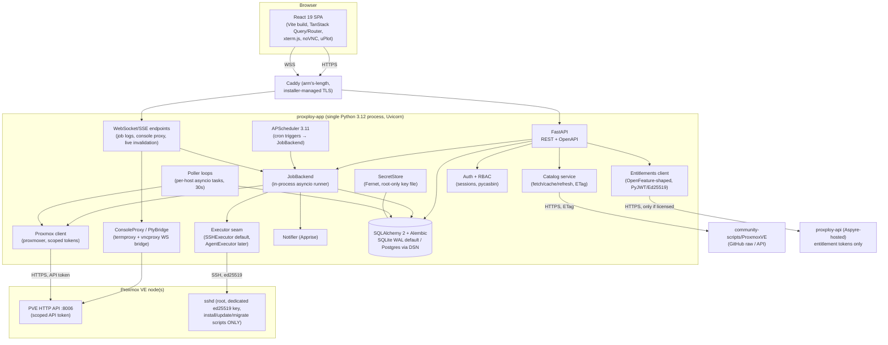
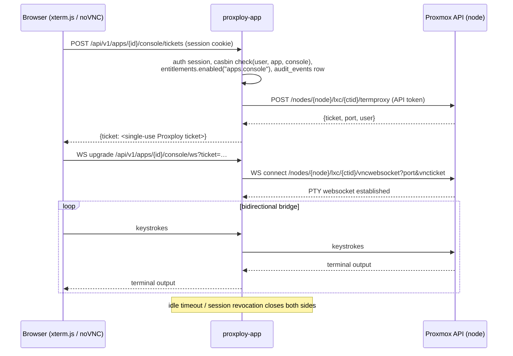

# Proxploy — System Architecture

Status: planning. Governed by `00-decision-brief.md`; if anything here conflicts
with the brief, the brief wins (and must be changed first).

## 1. Overview

Proxploy is one installable thing: **proxploy-app**, a single Python process
serving a React SPA and a REST/WebSocket API, talking to one or more Proxmox VE
nodes over their HTTP API (agentless by default). There is no message broker,
no sidecar database, no agent to deploy on nodes. Everything that looks like
infrastructure — job queue, scheduler, metrics store, log fanout — lives inside
the process, behind seams named in the brief (§5) so any piece can be swapped
out if a deployment outgrows it.

The other three properties (proxploy-api, proxploy-web, proxploy-docs) are
Aspyre-hosted and never installed by users. The app talks to exactly one of
them — proxploy-api — for exactly one purpose: entitlement token refresh
(doc 07). No analytics, no telemetry, no other call path.

## 2. Component diagram

## 3. Process layout

One OS process (per deployment form, see §9), one Uvicorn server, one asyncio
event loop. Inside it:

- **FastAPI application** — REST API under `/api/v1/*`, SSE endpoints at
  `/api/v1/*/stream` and WebSocket endpoints at `/api/v1/*/ws` (doc 05
  §Streaming), OpenAPI docs for free. Serves the built
  SPA as static files at `/` (single origin; no CORS in production).
- **React SPA** — built by Vite at release time, shipped as static assets
  inside the app package. TanStack Query owns all server state; polling
  endpoints plus SSE-driven cache invalidation give the "live" feel.
- **JobBackend** — the in-process asyncio job runner from brief §5. Every
  state-changing operation (lifecycle action, install, update, backup,
  migration) is a job: a DB row in `jobs`, log/progress lines in `job_events`,
  executed as an asyncio task. Enqueue/status/cancel/log-stream is the seam;
  Celery+Redis is the swap-in if multi-worker ever matters. Jobs survive
  restarts as records (a restarted app marks orphaned `running` jobs as
  `interrupted` on boot — it does not attempt to resume half-run root scripts).
- **Poller loops** — one long-lived asyncio task per connected host, polling
  Proxmox's **bulk** endpoints every 30s — `/cluster/resources` (node/CT/VM
  status and summary metrics for the whole host/cluster in one call) plus
  per-node `rrddata` for history-quality series — **never per-guest status
  calls**, so the poll cost stays flat as guest count grows. Writes
  `metric_samples` and refreshes the soft caches (`apps`, `vms`, `backups`
  state columns). A slow or dead host degrades only its own loop, never the
  event loop (per-host timeout + backoff).

  **Per-cycle API-call budget (per host):** one `/cluster/resources` call
  (covers every node/CT/VM in the host or cluster) plus one
  `/nodes/{node}/rrddata` call per node — budget target **O(nodes)**, never
  O(guests): a host with 200 CTs costs the same poll-cycle call count as one
  with 20. Any per-guest call (e.g. a live detail fetch triggered by opening
  an app) is user-triggered and outside the poll loop, not part of this
  budget.
- **APScheduler 3.11** — cron-like triggers (update windows, scheduled
  backups, metric rollup/pruning, catalog refresh, entitlement token refresh).
  Triggers never do work themselves; they enqueue jobs into JobBackend so
  everything scheduled is also logged, streamable, and cancellable.
  **Amendment, Phase 7, 2026-08-01, see `docs/notes/phase-7-operate.md`:**
  this said "APScheduler 4"; no 4.x release exists (PyPI's maximum stable is
  3.11.3, verified 2026-08-01). Only `CronTrigger` is used — the tick loop in
  `jobs/scheduler.py` reads the `schedules` table directly rather than
  running APScheduler's own scheduler/jobstore.
- **Database** — SQLAlchemy 2.x + Alembic. SQLite in WAL mode by default;
  Postgres via a single DSN change. Schema stays in the portable subset of
  both. All Proxmox-derived tables are named and treated as caches; Proxmox
  remains the source of truth for infra state, Proxploy owns app identity
  (app ↔ (host, ctid), scripts, metadata) — brief §9.

Concurrency model in one sentence: the event loop multiplexes I/O (HTTP to
Proxmox, SSH streams, websockets, DB); nothing CPU-heavy runs on it, and the
few blocking calls (Fernet, argon2, git-less catalog diffing) are small enough
to run inline or in the default thread pool.

## 4. Agentless model and the executor boundary

Two distinct channels to a Proxmox node, deliberately kept apart:

1. **Proxmox HTTP API via proxmoxer, scoped API tokens.** Used for everything
   the API can do: reads, metrics, lifecycle (start/stop/restart/pause),
   config, snapshots, backups, console ticket issuance (termproxy/vncproxy).
   Token scoping per capability is specified in doc 08 §2. Never root@pam
   password auth.
2. **SSH with a dedicated ed25519 key (asyncssh), used ONLY by the
   install/update/migration executor.** The Proxmox API deliberately has no
   "run arbitrary host command"; community scripts create CTs by running bash
   as root on the node, so installs need a real shell. The key is generated by
   Proxploy at host onboarding, authorized by the user, never reused for
   anything else, and every invocation is audit-logged with full output
   archived (brief §8). Consoles do **not** use SSH — Proxmox's own API
   provides the PTY websocket.

Both channels sit behind the **`Executor` seam**: `run(host, script, env) →
async stream of (stream, line)` plus lifecycle (cancel, timeout). The default
and only day-one implementation is `SSHExecutor`. The **optional agent** — an
outbound-only daemon on the node speaking to the app, removing the inbound SSH
requirement — is a later phase that implements the same interface. Nothing
anywhere else in the codebase may know which executor is in use, and no
feature may depend on the agent existing. That is the whole boundary: one
interface, one default implementation, agent slot reserved but empty.

`executor/` (doc 09) is the one component holding root-on-node power, so it
carries the repo's highest test-coverage bar and tightest review requirement
— unit tests plus integration tests against a throwaway PVE (doc 10 Phase
1/4). It is also the one place with a **hard, CI-enforced structural rule**:
an import-graph check fails the build if any module outside `executor/`
imports the SSH client or calls the SecretStore accessor that returns the
SSH key (doc 08 §4, doc 09) — enforced mechanically, not by convention.
Before Phase 4 invests further in `SSHExecutor`, a spike checks whether
current community-scripts tooling exposes a non-interactive or API-drivable
install path that would reduce or remove the need for root SSH; the design
above is what ships if — as expected — raw SSH-root remains necessary (doc
08 §4, doc 11 §1). The proxmoxer client layer behind `PXC`
(`backend/proxploy/services/proxmox.py`, doc 09) adapts the existing
lab-cluster-deploy proxmoxer module — CT lifecycle, cluster/node/guest reads,
migration calls — rather than being written from scratch; all PVE-8-vs-9
version branching is isolated to that one layer (doc 03, doc 11 §7).

## 5. Consoles: proxied Proxmox websockets with our auth in front

The browser never talks to Proxmox directly (mixed origins, per-user PVE
credentials, LAN exposure). The backend obtains a short-lived console ticket
from Proxmox with its scoped token, then bridges the two websockets, enforcing
Proxploy session auth + RBAC + entitlements on the way in.

VM consoles are identical in shape with `vncproxy` + `vncwebsocket` and noVNC
on the client; node shells use node-level `termproxy` (gated by the stricter
`Sys.Console` scope and an admin-role casbin rule). The Proxploy ticket
is a single-use, short-TTL server-side handle (doc 05 §Streaming) binding the
upgrade request to the Proxmox ticket already fetched — the Proxmox ticket
itself never reaches the browser. This whole path is the `PtyBridge`/`ConsoleProxy` seam from the
brief; Guacamole is the arm's-length swap-in if SPICE/RDP demand appears.

## 6. Install script execution and streaming

An App Store install is root-on-your-node, exactly like running the community
script yourself; Proxploy adds provenance, streaming, and an archive — not
sandboxing (brief §8). The pipeline:

1. **Resolve + pin.** The install job snapshots the exact script content from
   the catalog cache into `app_scripts` (versioned), and diffs it against
   live upstream; a drifted script blocks with a visible diff until the user
   confirms. What ran is always exactly what is stored.
2. **Execute.** JobBackend hands the pinned script to the `Executor`
   (SSHExecutor: asyncssh session as root with the dedicated key, script
   piped to bash, env vars for non-interactive answers). One `audit_events`
   row records actor, host, script version hash, and result.
3. **Stream.** Every stdout/stderr line becomes a `job_events` row
   (job_id, seq, stream, line, ts) — the DB is the source of truth for the
   log, written as the lines arrive.
4. **Fan out.** An in-process pub/sub (plain asyncio queues keyed by job_id)
   pushes new `job_events` to any subscribed WebSocket/SSE clients. A browser
   attaching mid-install first reads the backlog from the DB, then follows
   live. Zero subscribers costs nothing; the DB write always happens.
5. **Archive.** On completion the full log persists in `job_events`
   (retention per doc 04 — install/update transcripts kept for the app's
   lifetime), the job row records exit status and
   duration, the app ↔ (host, ctid) mapping is written, and Apprise fires
   configured notifications.

Updates and migrations run through the identical pipeline — same executor,
same streaming, same archive; only the script and the job type differ.

## 7. Catalog layer: fetch, cache, refresh

Brief rule 2: the browser never fetches the catalog; the backend does.

- **Fetch.** The catalog service pulls community-scripts/ProxmoxVE JSON
  metadata (and, on demand, script bodies) server-side over HTTPS.
- **Cache.** Everything lands in `catalog_entries` (metadata, script body,
  upstream ETag/commit ref, fetched_at). The App Store UI reads only from the
  DB — it works offline and is immune to GitHub rate limits and outages.
- **Refresh.** A scheduled job (`catalog.refresh`, fired by the
  `jobs/scheduler.py` tick loop against the seeded "Catalog refresh" row) re-
  fetches on an interval using conditional requests (`If-None-Match` with the
  stored ETag); 304 costs one request and no writes. Manual "refresh now"
  enqueues the same job. **Amendment, Phase 7, 2026-08-01:** "An APScheduler
  job" corrected — see the line-108 amendment above; the mechanism is the
  same tick loop everywhere in this doc, not APScheduler's own scheduler.
- **Fallback.** If the optional Aspyre-hosted mirror is configured it is
  tried first as a dumb CDN, but the app **always** falls back to fetching
  upstream directly — the mirror is a bandwidth nicety, never a dependency,
  and is entirely separate from proxploy-api.

## 8. Four-property topology and the entitlement call path

| Property | Where it runs | The app's relationship to it |
|---|---|---|
| proxploy-app | User's infrastructure | The product. The only thing users install. |
| proxploy-api | Aspyre-hosted | The **single** outbound app→Aspyre call path: activate license, refresh entitlement token, revoke. Skipped entirely when no license is configured (air-gapped free tier). No analytics or telemetry ever rides this channel. Full design in doc 07. |
| proxploy-web | Aspyre-hosted | proxploy.com marketing/download. The app never calls it. |
| proxploy-docs | Aspyre-hosted | Documentation. The app links to it; never calls it. |

Inside the app, the Entitlements client is consulted on every gated request
(backend decorator/dependency) and exposed to the SPA as a resolved flag map
via `GET /api/v1/entitlements`. UI hides or veils; the server always re-enforces.
Dormant default: everything on. Doc 07 owns the detail.

## 9. Security and trust model (summary — doc 08 owns detail)

- Scoped Proxmox API tokens per capability, never root@pam passwords.
- Host credentials and the SSH private key encrypted at rest
  (Fernet/MultiFernet via `cryptography`, root-only master key file).
- SSH executor is the only root channel, only for install/update/migration,
  every use audit-logged with archived output.
- Local auth: argon2id, server-side DB sessions, CSRF, rate limiting, TOTP;
  OIDC via Authlib. RBAC via pycasbin (owner/admin/operator/viewer, teams as
  domains).
- Append-only `audit_events` for every state change; no delete path.
- Ships locked down: LAN bind, TLS by default (Caddy or self-signed), no
  telemetry.
- Honest residual: a compromised Proxploy host holds credentials to every
  connected node. Doc 08 §9 covers blast-radius limits.
- **Self-management guardrail:** destructive actions (stop, delete, migrate)
  are checked against the CT/host Proxploy is itself running on (detected via
  the CT id + hostname recorded at install); a detected match is refused, or
  at minimum requires a typed confirmation with an explicit warning, before
  the job is enqueued. A tool that can stop its own CT can brick its own
  recovery path (doc 08 §1/§9).

## 10. Deployment forms

All four forms run the same single process; only packaging differs.

| Form | What it is | Notes |
|---|---|---|
| LXC install (flagship) | One-line installer creates a Proxploy CT on a PVE node | Mirrors the community-scripts experience users already know. Installer sets up systemd unit + Caddy + master key file inside the CT. |
| Docker / Compose | Image + compose file; volume for DB, secrets dir, config | Caddy as an optional second service in the compose file, or bring-your-own reverse proxy. |
| systemd (bare) | pipx/venv install + provided unit file | For "just run it on this VM" users. |
| Caddy in front | Arm's-length process managed by the installer for TLS/HTTP2 | App also serves plain HTTP behind it, and can self-sign via `cryptography` if Caddy is declined — TLS-by-default either way. |

SQLite (WAL) is the default everywhere; Postgres is a DSN change, not a
different deployment form.

## 11. Data-flow narratives

### 11.1 Dashboard live metrics

Per-host poller task → proxmoxer GET `/cluster/resources` (all node/CT/VM
status in one bulk call, brief §5 poller budget) + per-node `rrddata`
(history-quality series, storage) every 30s → writes `metric_samples` +
updates cache tables →
publishes an invalidation event on the in-process bus → SSE endpoint
`/api/v1/events/stream` pushes `{topic: "host.{id}.metrics"}` to connected browsers →
TanStack Query invalidates the matching queries → SPA refetches
`/api/v1/cluster/summary` and `/api/v1/metrics/query` → uPlot re-renders. If SSE is
absent (proxy strips it), Query's normal refetch interval keeps the dashboard
merely 30s-fresh instead of push-fresh. The `metrics.maintain` job — fired
hourly by the seeded "Metrics maintenance" `schedules` row, via the
`jobs/scheduler.py` tick loop, not APScheduler's own scheduler (**amendment,
Phase 7, 2026-08-01**, see the line-108 amendment above) — rolls raw samples
into 5m/1h `metric_rollups` and prunes per retention; chart queries pick raw
vs rollup by requested time range.

### 11.2 An app install

User clicks Install in the App Store → SPA `POST /api/v1/catalog/{slug}/install`
(host, resource overrides) → FastAPI dependency chain runs: session auth → casbin
`check(user, host, install)` → `entitlements.enabled("store.install")` →
handler pins the script into `app_scripts`, writes the `jobs` row and the
`audit_events` row, enqueues in JobBackend, returns `job_id` → SPA opens the SSE stream
`GET /api/v1/jobs/{id}/events/stream` and renders the streaming log view → JobBackend runs
SSHExecutor (root shell on the node, pinned script) → each output line →
`job_events` row → fanout → browser terminal-style log → script finishes,
CT exists → job finalizer verifies the CT via the Proxmox API, writes the
app ↔ (host, ctid) mapping and app metadata, marks the job `succeeded`,
notifies via Apprise → next poller cycle picks the CT up and the new App tile
goes live on the Apps page.

### 11.3 Opening a CT console

User clicks Console on an app tile → SPA `POST /api/v1/apps/{id}/console/tickets` →
backend authenticates the session, authorizes via casbin, checks
`entitlements.enabled("apps.console")`, writes the audit row → backend calls
Proxmox `termproxy` with its scoped API token, receives a short-lived ticket
→ backend stores {ticket, node, ctid, user} under a single-use Proxploy
ticket and returns it → SPA opens the WebSocket
(`/api/v1/apps/{id}/console/ws?ticket=…`); xterm.js attaches → backend dials
Proxmox `vncwebsocket` with the stored ticket and bridges bytes both ways
until either side closes, the idle timeout fires, or the Proxploy session is
revoked. Sequence diagram in §5. The Proxmox ticket and the PVE API token
never touch the browser.
