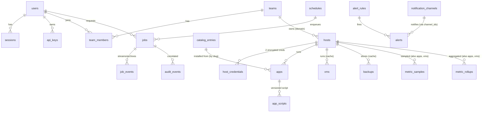

# 04 — Data Model

Owner doc for the full schema. Conforms to the decision brief §9: every entity
listed there appears here, integer PKs everywhere, `created_at`/`updated_at`
UTC timestamps, and the schema stays inside the portable SQLite/Postgres
subset (SQLAlchemy 2.x models, Alembic migrations — brief §4).

## Conventions

- **Types** (portable subset): `int` (INTEGER / BIGINT where flagged), `text`,
  `real`, `bool` (INTEGER 0/1 on SQLite, BOOLEAN on PG — SQLAlchemy handles
  it), `datetime` (UTC, timezone-naive stored as UTC; SQLAlchemy `DateTime`),
  `json` (TEXT on SQLite, JSONB on PG via SQLAlchemy `JSON`), `blob` (BLOB /
  BYTEA).
- **PKs**: every table has `id int PK` (autoincrement). No composite PKs;
  uniqueness expressed as unique indexes.
- **Timestamps**: `created_at datetime NOT NULL`, `updated_at datetime NOT
  NULL` on every table except the three append-only/high-volume tables
  (`audit_events`, `job_events`, `metric_samples`), which carry only their
  event timestamp — they are never updated.
- **Caches**: tables holding Proxmox-owned state are explicitly marked
  **CACHE**. Proxmox is the source of truth for infra state; a cache row can
  always be dropped and re-synced. Proxploy is the source of truth for **app
  identity**: the `apps` table's `(host_id, ctid)` mapping plus the saved
  script in `app_scripts` — that data cannot be reconstructed from Proxmox.
  All cache tables (`apps`.*_cached columns, `vms`, `backups`,
  `metric_samples`) are populated from Proxmox's **bulk** endpoints
  (`/cluster/resources`, per-node `rrddata`) on the 30s poll cycle, never
  per-guest calls — doc 02 §3 defines the per-cycle API-call budget this
  keeps flat regardless of guest count.
- **Secrets**: `host_credentials` and `notification_channels` store
  Fernet-encrypted blobs (MultiFernet, `key_version` for rotation — brief §5
  SecretStore). Plaintext secrets never touch the database.
- **Soft deletes**: none. Deleting an app deletes its script versions
  (cascade); `audit_events` is the permanent record of what existed.

---

## Identity & access

### users
Local and OIDC-federated accounts. Authorization lives in `casbin_rules`, not here.

| Column | Type | Notes |
|---|---|---|
| id | int PK | |
| email | text | NOT NULL, unique index |
| display_name | text | |
| password_hash | text | argon2id (argon2-cffi); NULL for OIDC-only accounts |
| totp_secret_enc | blob | Fernet-encrypted TOTP seed; NULL = TOTP not enrolled |
| totp_enabled | bool | default false; enforced at login only when true |
| oidc_issuer | text | NULL for local accounts |
| oidc_sub | text | unique index with `oidc_issuer` when set |
| is_active | bool | default true; false blocks login + API keys |
| last_login_at | datetime | |
| created_at / updated_at | datetime | |

Indexes: `ux_users_email(email)`, `ux_users_oidc(oidc_issuer, oidc_sub)`.

### sessions
Server-side DB sessions (brief §5 AuthN — no JWT sessions). Cookie carries an opaque token; only its hash is stored.

| Column | Type | Notes |
|---|---|---|
| id | int PK | |
| user_id | int FK → users | ON DELETE CASCADE |
| token_hash | text | SHA-256 of the cookie token, unique index |
| ip | text | |
| user_agent | text | |
| expires_at | datetime | absolute expiry |
| last_seen_at | datetime | sliding-activity display, rate-limited writes |
| revoked_at | datetime | NULL = live; set on logout / "sign out everywhere" |
| created_at / updated_at | datetime | |

Indexes: `ux_sessions_token(token_hash)`, `ix_sessions_user(user_id)`.

### api_keys
Automation credentials for the public REST API (entitlement `api.tokens`). Shown once at creation; only hash + display prefix persist.

| Column | Type | Notes |
|---|---|---|
| id | int PK | |
| user_id | int FK → users | key acts *as* this user, capped by their role |
| name | text | user label |
| prefix | text | first 8 chars, for list display (`ppk_a1b2…`) |
| key_hash | text | SHA-256, unique index |
| scopes | json | list of scope strings (`["read","apps:write"]`); empty = full user rights |
| expires_at | datetime | NULL = no expiry |
| last_used_at | datetime | |
| revoked_at | datetime | NULL = active |
| created_at / updated_at | datetime | |

Indexes: `ux_api_keys_hash(key_hash)`, `ix_api_keys_user(user_id)`.

### teams
Casbin domains (brief §5 AuthZ: RBAC with domains = teams). Entitlement `teams.rbac`; a default team is created at first run so single-user installs never see this.

| Column | Type | Notes |
|---|---|---|
| id | int PK | |
| name | text | unique index |
| slug | text | unique index, URL-safe |
| description | text | |
| created_at / updated_at | datetime | |

### team_members

| Column | Type | Notes |
|---|---|---|
| id | int PK | |
| team_id | int FK → teams | ON DELETE CASCADE |
| user_id | int FK → users | ON DELETE CASCADE |
| role | text | `owner` \| `admin` \| `operator` \| `viewer` (mirrored into casbin_rules by the service layer) |
| created_at / updated_at | datetime | |

Indexes: `ux_team_members(team_id, user_id)`.

### casbin_rules
pycasbin's standard storage table (sqlalchemy-adapter shape). Managed only through the `Authorizer` seam — never written directly.

| Column | Type | Notes |
|---|---|---|
| id | int PK | |
| ptype | text | `p` (policy) or `g` (grouping) |
| v0 … v5 | text | subject, domain(team), object, action, … |

Indexes: `ix_casbin(ptype, v0, v1)`. No timestamps (library-owned table).

---

## Infrastructure

### hosts
One row per connected Proxmox node/endpoint. Multi-row gated by `hosts.multi`.

| Column | Type | Notes |
|---|---|---|
| id | int PK | |
| name | text | display name, unique index |
| address | text | `https://host:8006` API base |
| node_name | text | PVE node name as reported by the API |
| cluster_name | text | NULL when standalone |
| verify_tls | bool | default true |
| tls_fingerprint | text | pinned cert fingerprint when `verify_tls` is false |
| status | text | `connected` \| `unreachable` \| `error` (cached poll result) |
| pve_version | text | cached |
| last_seen_at | datetime | last successful poll |
| team_id | int FK → teams | owning domain, NULL = default team |
| created_at / updated_at | datetime | |

### host_credentials
**Encrypted blobs only** (brief §8). Two kinds per host: the scoped API token (all read/lifecycle/console ops) and the dedicated ed25519 SSH key (install/update/migration executor only). Never plaintext, never root@pam password.

| Column | Type | Notes |
|---|---|---|
| id | int PK | |
| host_id | int FK → hosts | ON DELETE CASCADE |
| kind | text | `api_token` \| `ssh_key` |
| encrypted_blob | blob | Fernet ciphertext: token-id+secret, or PEM private key |
| key_version | int | MultiFernet key index for rotation |
| public_meta | text | non-secret half: token id (`proxploy@pve!ro`), or SSH public key line — safe to display |
| last_used_at | datetime | |
| created_at / updated_at | datetime | |

Indexes: `ux_host_creds(host_id, kind)`. No SELECT path returns
`encrypted_blob` outside the `SecretStore` service.

---

## Apps (Proxploy-owned identity)

### apps
**Not a cache.** The core Proxploy invention: app ↔ (host, ctid) mapping plus display/metadata. Columns marked *(cached)* mirror live CT state and are refreshed by the poller.

| Column | Type | Notes |
|---|---|---|
| id | int PK | |
| host_id | int FK → hosts | ON DELETE RESTRICT (must detach apps before removing a host) |
| ctid | int | Proxmox CT id |
| name | text | display name ("Home Assistant") |
| slug | text | url-safe, unique index |
| catalog_slug | text | link to `catalog_entries.slug`; NULL for adopted CTs with no catalog origin |
| category | text | store category ("Media", "Network", …) |
| icon_initials | text | 2-char tile initials (prototype `in:`) |
| icon_colors | json | `{"c1":"#A78BFA","c2":"#7C5CFB"}` gradient pair (prototype tokens) |
| web_port | int | "Open web UI" target port |
| web_protocol | text | `http` \| `https`, default http |
| web_path | text | default `/` |
| status_cached | text | *(cached)* `running` \| `stopped` \| `unknown` |
| ip_cached | text | *(cached)* CT primary IP |
| cpu_pct_cached | real | *(cached)* latest sample, for grid cards |
| mem_bytes_cached | int | *(cached)* |
| uptime_s_cached | int | *(cached)* |
| update_available | text | *(cached)* version string when the update-checker finds one, NULL otherwise |
| adopted | bool | true = pre-existing CT adopted into Proxploy, not store-installed |
| created_at / updated_at | datetime | |

Indexes: `ux_apps_host_ctid(host_id, ctid)`, `ux_apps_slug(slug)`.

### app_scripts
Versioned saved/edited community script per app (brief §9). Append-only versions; the "Config" tab in the detail view edits this. Content is pinned and diffed against upstream before every run (brief §8 provenance).

| Column | Type | Notes |
|---|---|---|
| id | int PK | |
| app_id | int FK → apps | ON DELETE CASCADE |
| version | int | monotonic per app, 1-based |
| content | text | full bash script |
| content_sha256 | text | integrity pin; executor refuses to run if mismatch |
| source | text | `upstream` (verbatim import) \| `edited` (user-modified) |
| upstream_ref | text | upstream repo path + commit SHA the version was taken from / diffed against |
| created_by | int FK → users | NULL for system imports |
| created_at / updated_at | datetime | |

Indexes: `ux_app_scripts(app_id, version)`. Current script = max(version).

### vms — **CACHE**
Mirror of Proxmox QEMU guests for the VMs table/detail views. Droppable; re-synced by the poller.

| Column | Type | Notes |
|---|---|---|
| id | int PK | |
| host_id | int FK → hosts | ON DELETE CASCADE |
| vmid | int | |
| name | text | |
| status | text | `running` \| `stopped` \| `paused` |
| os_type | text | PVE ostype, mapped to icon (`win`/`linux`/`fw`/`disk` in the prototype) |
| cpu_cores | int | |
| mem_bytes | int | allocated |
| disk_bytes | int | total allocated |
| uptime_s | int | |
| synced_at | datetime | last poll that touched this row |
| created_at / updated_at | datetime | |

Indexes: `ux_vms(host_id, vmid)`.

### catalog_entries — **CACHE**
community-scripts/ProxmoxVE metadata, fetched server-side with ETag refresh (brief §5 CatalogSource). Never fetched from the browser.

| Column | Type | Notes |
|---|---|---|
| id | int PK | |
| slug | text | upstream script slug, unique index |
| name | text | |
| description | text | |
| category | text | store chip categories |
| script_path | text | upstream repo path of the install entrypoint |
| website / docs_url | text | |
| default_cpu | int | upstream resource defaults |
| default_ram_mb | int | |
| default_disk_gb | int | |
| default_os / default_os_version | text | e.g. `debian` / `12` |
| icon_url | text | |
| popularity | int | stars/installs figure for sorting (prototype `pop`) |
| upstream_sha | text | commit the metadata was read at |
| raw | json | full upstream JSON record, forward-compat |
| deprecated | bool | upstream removed/renamed; kept so installed apps still resolve |
| installable | bool | set by ingest's install-feasibility classifier: true when the paired `ct/` script has exactly one `build_container` call AND the paired `install/` script has no unguarded interactive prompt (`read`/`whiptail`/`dialog` not preceded by an env-var short-circuit) — mechanical, not a guess (doc 01 §3, doc 11 §8, `docs/notes/phase-4-spike.md`); the store only ever offers `install` on true rows |
| unsupported_reason | text | NULL when `installable`; short honest reason set by ingest otherwise (e.g. "multi-CT / docker-compose pattern", "install script requires interactive input, no non-interactive entrypoint") — shown in the store UI next to the upstream link |
| synced_at | datetime | |
| created_at / updated_at | datetime | |

Catalog-level ETag + last-sync live in `settings` (`catalog.etag`, `catalog.synced_at`).
The true count of `installable = true` rows is the number reported in Phase
4's definition of done (doc 10), replacing any "300+ scripts" placeholder —
the classifier rule above measured ≈88.2% (493/559) against the current
upstream corpus (`docs/notes/phase-4-spike.md`); ingest will report the
live figure at Phase 4 completion.

---

## Jobs & scheduling

### jobs
Persisted units of work for the in-process asyncio JobBackend (brief §5). Everything state-changing that takes time is a job: installs, updates, lifecycle, backups, migrations, syncs.

| Column | Type | Notes |
|---|---|---|
| id | int PK | |
| kind | text | dotted verb: `app.install`, `app.update`, `app.start`, `vm.stop`, `backup.run`, `host.sync`, `catalog.refresh`, `migrate.app`, … |
| status | text | `queued` \| `running` \| `succeeded` \| `failed` \| `canceled` \| `interrupted` (orphaned `running` jobs marked on boot — doc 02 §3; never resumed) |
| target_type | text | `host` \| `app` \| `vm` \| `system` |
| target_id | int | id in the target table; NULL for `system` |
| params | json | job input (redacted of secrets before persist) |
| result | json | structured output |
| error | text | terminal error message |
| progress_pct | int | 0–100, NULL when indeterminate |
| requested_by | int FK → users | NULL when spawned by a schedule/system |
| schedule_id | int FK → schedules | NULL for ad-hoc jobs |
| started_at / finished_at | datetime | |
| created_at / updated_at | datetime | |

Indexes: `ix_jobs_status(status, created_at)`, `ix_jobs_target(target_type, target_id, created_at)`.

### job_events
Append-only log lines / progress ticks per job — the backing store for the live install stream and the archived transcript (brief §8: full output streamed **and archived**). BIGINT PK.

| Column | Type | Notes |
|---|---|---|
| id | int PK (BIGINT) | |
| job_id | int FK → jobs | ON DELETE CASCADE |
| seq | int | monotonic per job; SSE `Last-Event-ID` resume cursor |
| ts | datetime | |
| stream | text | `stdout` \| `stderr` \| `progress` \| `status` |
| message | text | one line / one tick |

Indexes: `ux_job_events(job_id, seq)`. No `updated_at` — rows are never mutated.

### schedules
APScheduler 4 triggers feeding the JobBackend (brief §5). APScheduler's own state is reconstructed from these rows at boot; this table is authoritative.

| Column | Type | Notes |
|---|---|---|
| id | int PK | |
| name | text | |
| job_kind | text | the `jobs.kind` to enqueue |
| cron | text | 5-field cron expression |
| timezone | text | IANA tz, default UTC |
| params | json | forwarded to the job |
| enabled | bool | |
| last_run_at / next_run_at | datetime | |
| created_by | int FK → users | |
| created_at / updated_at | datetime | |

---

## Notifications & alerting

### notification_channels
Apprise targets (brief §5 Notifier). Apprise URLs embed tokens/passwords, so the URL itself is an encrypted blob.

| Column | Type | Notes |
|---|---|---|
| id | int PK | |
| name | text | |
| kind | text | display label parsed from the URL scheme: `ntfy`, `gotify`, `email`, `telegram`, `slack`, `webhook`, … |
| url_enc | blob | Fernet-encrypted Apprise URL |
| key_version | int | MultiFernet rotation index |
| events | json | subscribed event types (`["job.failed","alert.fired","app.updated"]`); empty = all |
| enabled | bool | |
| last_notified_at | datetime | |
| created_at / updated_at | datetime | |

### alert_rules
Threshold rules over metrics (entitlement `alerts.rules`).

| Column | Type | Notes |
|---|---|---|
| id | int PK | |
| name | text | |
| metric | text | `cpu_pct` \| `mem_pct` \| `disk_pct` \| `host_offline` \| `backup_failed` … |
| target_type | text | `host` \| `app` \| `vm` \| `any` |
| target_id | int | NULL when `any` |
| operator | text | `gt` \| `lt` |
| threshold | real | |
| duration_s | int | must hold for this long before firing (prototype: "85% CPU for 5 minutes") |
| severity | text | `info` \| `warning` \| `critical` |
| channel_ids | json | notification_channels to fan out to |
| enabled | bool | |
| created_at / updated_at | datetime | |

### alerts
Fired instances of rules; drives the sidebar health footer ("3 nodes · 0 alerts") and the activity feed.

| Column | Type | Notes |
|---|---|---|
| id | int PK | |
| rule_id | int FK → alert_rules | ON DELETE CASCADE |
| target_type / target_id | text / int | resolved concrete target |
| state | text | `firing` \| `resolved` |
| value | real | observed value at fire time |
| message | text | rendered summary |
| fired_at / resolved_at | datetime | |
| acked_by | int FK → users | NULL = unacked |
| acked_at | datetime | |
| created_at / updated_at | datetime | |

Indexes: `ix_alerts_state(state, fired_at)`.

---

## Metrics

### metric_samples
Raw 30 s poll samples (brief §5 MetricsStore). BIGINT PK, hottest table in the system; kept lean and pruned aggressively.

| Column | Type | Notes |
|---|---|---|
| id | int PK (BIGINT) | |
| target_type | text | `host` \| `app` \| `vm` |
| target_id | int | |
| metric | text | `cpu_pct`, `mem_bytes`, `disk_bytes`, `net_in_bps`, `net_out_bps`, `io_read_bps`, `io_write_bps` |
| value | real | |
| ts | datetime | sample time |

Indexes: `ix_samples(target_type, target_id, metric, ts)`. No timestamps beyond `ts` — append-only, pruned by retention job.

### metric_rollups
5-minute and 1-hour aggregates, written by a rollup job, read by all charts older than the raw window.

| Column | Type | Notes |
|---|---|---|
| id | int PK (BIGINT) | |
| target_type / target_id / metric | as above | |
| resolution | text | `5m` \| `1h` |
| bucket_ts | datetime | bucket start, aligned |
| min / max / avg | real | |
| sample_count | int | |
| created_at / updated_at | datetime | |

Indexes: `ux_rollups(target_type, target_id, metric, resolution, bucket_ts)`.

---

## Backups

### backups — **CACHE**
Mirror of PBS datastore / vzdump archives per host (entitlement `backups.pbs`). Restore/delete operate through the Proxmox API; this table only feeds the Backups page.

| Column | Type | Notes |
|---|---|---|
| id | int PK | |
| host_id | int FK → hosts | ON DELETE CASCADE |
| storage | text | datastore name (`pbs-datastore`, `local`) |
| volid | text | Proxmox volume id — the real identifier upstream |
| guest_type | text | `ct` \| `vm` |
| guest_vmid | int | CTID/VMID at backup time |
| guest_name | text | resolved display name at sync time |
| taken_at | datetime | backup timestamp from Proxmox |
| size_bytes | int | |
| verify_state | text | `ok` \| `failed` \| `none` (PBS verification) |
| notes | text | Proxmox backup notes field |
| synced_at | datetime | |
| created_at / updated_at | datetime | |

Indexes: `ux_backups(host_id, volid)`, `ix_backups_guest(guest_type, guest_vmid)`.

---

## Audit, entitlements, settings

### audit_events — **append-only**
Every state-changing action (brief §8). The application exposes **no UPDATE or DELETE path** for this table — no ORM model method, no endpoint, no admin tool. Archival is export-then-truncate, operator-initiated or via the opt-in `audit.retention` policy (see retention). BIGINT PK.

| Column | Type | Notes |
|---|---|---|
| id | int PK (BIGINT) | |
| ts | datetime | |
| actor_type | text | `user` \| `api_key` \| `system` (scheduler, poller) |
| actor_id | int | users.id or api_keys.id; NULL for system |
| action | text | dotted verb matching job kinds where applicable (`app.install`, `host.credential.rotate`, `auth.login.failed`) |
| target_type / target_id | text / int | |
| params | json | request params, secrets redacted before write |
| result | text | `ok` \| `error` \| `denied` |
| ip | text | source address |
| request_id | text | correlates with access logs |
| job_id | int | FK → jobs when the action spawned a job |

Indexes: `ix_audit_ts(ts)`, `ix_audit_actor(actor_type, actor_id, ts)`, `ix_audit_target(target_type, target_id, ts)`.

### entitlement_cache
Single-row (id = 1) cache of the last signed entitlement token + its resolved claims (brief §7). With no license configured this row holds the built-in default map and no network calls ever happen.

| Column | Type | Notes |
|---|---|---|
| id | int PK | always 1 |
| token | text | EdDSA-signed JWT from proxploy-api, Fernet-encrypted at rest (doc 08 §3); NULL when unlicensed |
| tier | text | `free` \| `pro` \| … ; `builtin` when unlicensed |
| features | json | resolved flag map `{"hosts.multi": true, …}` — what `GET /api/v1/entitlements` serves |
| issued_at / expires_at | datetime | token claims (~72 h expiry) |
| grace_until | datetime | offline validity horizon (~30 d) |
| fetched_at | datetime | last successful refresh |
| last_verified_at | datetime | last offline signature verification |
| created_at / updated_at | datetime | |

### settings
Untyped key/value for everything that doesn't deserve a table: bind address, TLS mode, catalog source + ETag, maintenance window, poll intervals, onboarding-complete flag. Secret-bearing values are stored Fernet-encrypted with a `.enc` key suffix convention and only decrypted via SecretStore.

| Column | Type | Notes |
|---|---|---|
| id | int PK | |
| key | text | dotted namespace (`catalog.etag`, `server.bind`, `updates.window`), unique index |
| value | json | |
| created_at / updated_at | datetime | |

---

## ER diagram (core relationships)

(`metric_*` and `audit_events` reference targets polymorphically via
`target_type`/`target_id`, so no hard FKs there by design — cache rows and
targets may outlive each other.)

---

## Retention & pruning

All pruning runs as scheduled system jobs (visible in the activity feed like
any other job), intervals adjustable via `settings`:

| Table | Policy | Default |
|---|---|---|
| `metric_samples` | delete rows older than the raw window; rollup job has already aggregated them | 48 h |
| `metric_rollups` (5m) | delete buckets older than window | 14 d |
| `metric_rollups` (1h) | delete buckets older than window | 400 d (13 months for year-over-year charts) |
| `job_events` | keep transcripts for terminal jobs N days, **except** `app.install` / `app.update` transcripts which are kept as long as the app exists (provenance requirement, brief §8) | 90 d |
| `jobs` | terminal jobs pruned with their events | 90 d |
| `sessions` | delete expired + revoked rows | 7 d after expiry |
| `alerts` | resolved alerts pruned | 180 d |
| `audit_events` | **no automatic pruning by default.** Operator-initiated archival: `proxploy audit export` writes JSONL to a file, then (optionally, explicit flag) truncates exported rows. Opt-in configurable policy (`audit.retention`, doc 08 §7) schedules the same export-then-prune, deleting only rows verifiably landed in a completed archive — never below a floor. No other delete path exists. | manual |

SQLite runs in WAL mode (brief §4); the sample writer batches inserts per
poll cycle to keep write contention down (risk noted in brief §11 — the seam
to Postgres/VictoriaMetrics exists if an install outgrows this).
